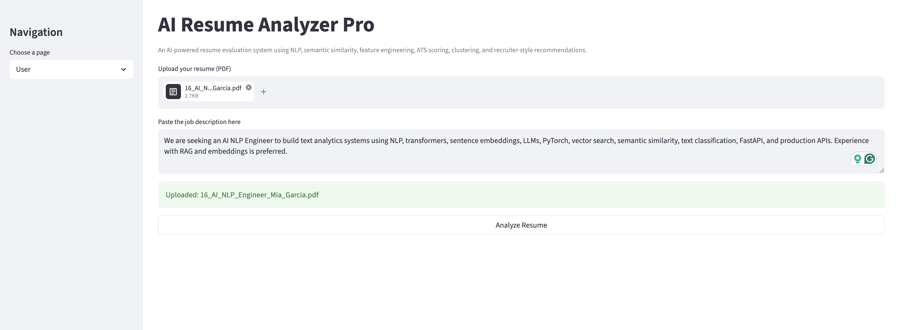
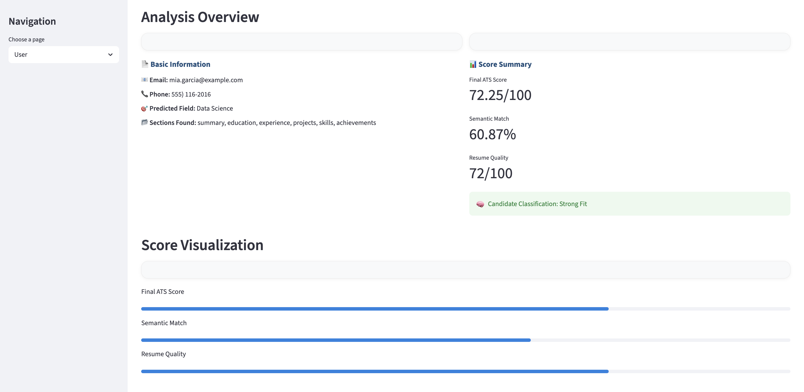
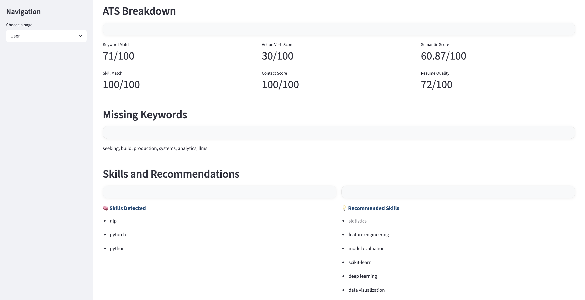
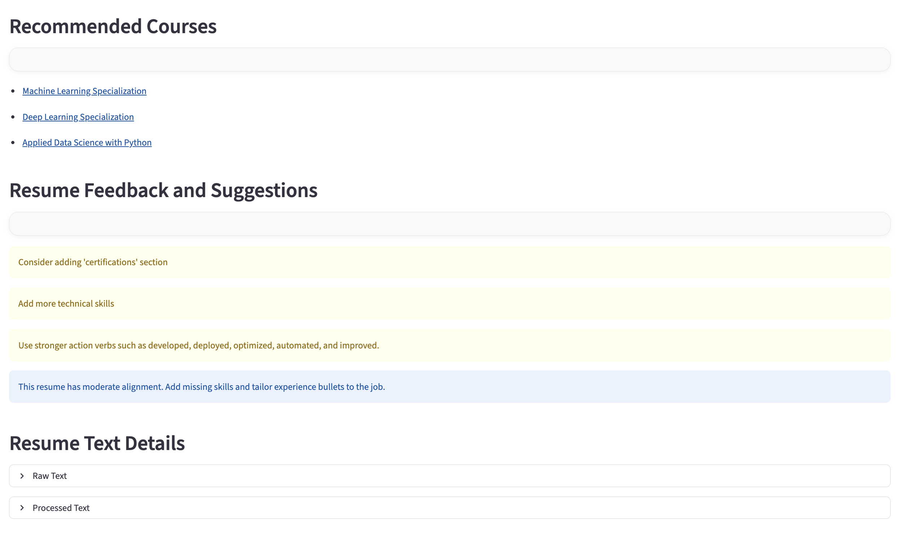
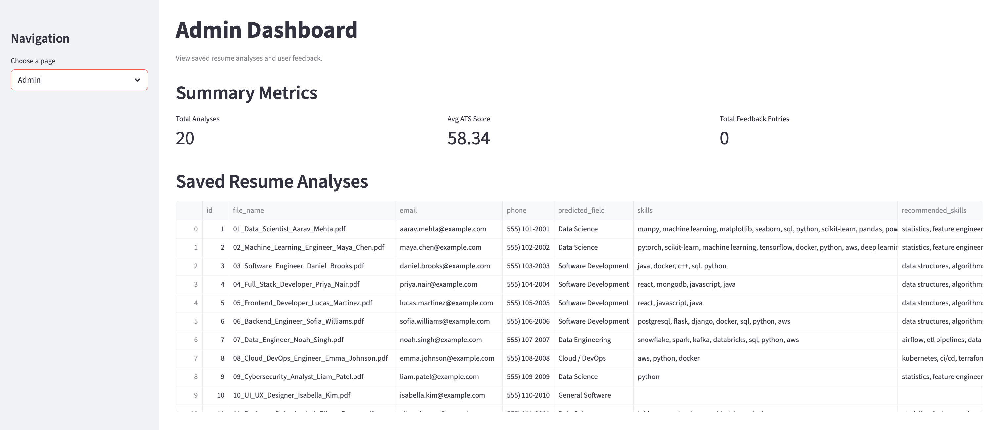
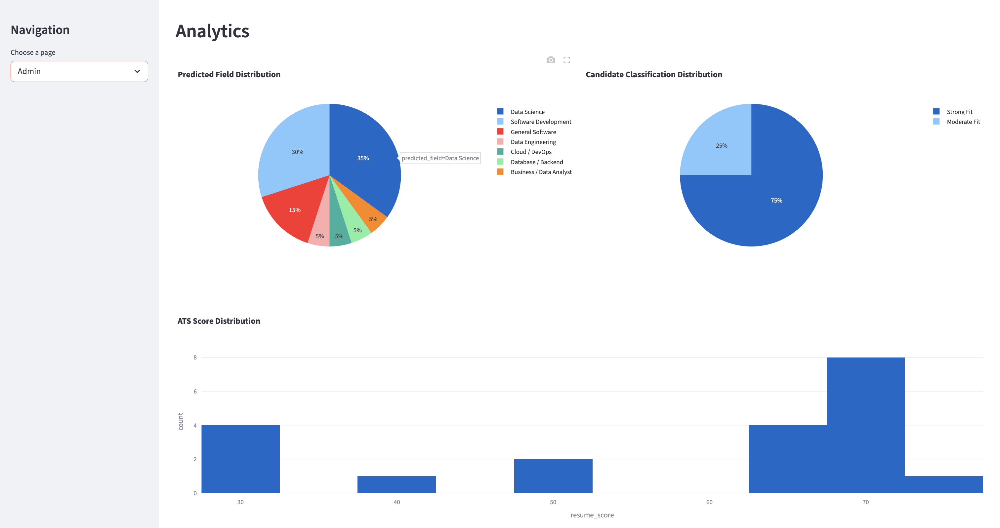

# AI Resume Analyzer Pro

An AI-powered Resume Analyzer built using NLP, Semantic Similarity, ATS Scoring, Feature Engineering, and Recruiter-style Analytics.

## Overview

AI Resume Analyzer Pro helps job seekers evaluate resumes against job descriptions using ATS-style scoring techniques. The system extracts skills, predicts career domains, measures semantic similarity, identifies missing keywords, provides personalized recommendations, and visualizes candidate analytics.

---

## Features

### Resume Analysis
- PDF Resume Parsing
- Skill Extraction
- Contact Information Extraction
- Resume Section Detection
- Career Field Prediction
- Resume Quality Assessment

### ATS Scoring
- Keyword Match Score
- Semantic Similarity Score
- Skill Match Score
- Contact Information Score
- Action Verb Score
- Final ATS Score Calculation

### Recommendations
- Missing Keyword Detection
- Recommended Skills
- Resume Improvement Suggestions
- Course Recommendations
- Candidate Classification

### Analytics Dashboard
- Resume Analysis Tracking
- ATS Score Distribution
- Predicted Field Distribution
- Candidate Classification Distribution
- Historical Resume Records

### Database Integration
- SQLite Storage
- Resume History Management
- Feedback Storage
- Analytics Reporting

---

## Tech Stack

### Frontend
- Streamlit

### Backend
- Python

### Machine Learning & NLP
- Scikit-Learn
- TF-IDF Vectorization
- Cosine Similarity
- Feature Engineering

### Data Processing
- Pandas
- NumPy

### Visualization
- Plotly
- Plotly Express

### Database
- SQLite

---

## Project Workflow

1. Upload Resume PDF
2. Extract Resume Text
3. Extract Skills and Resume Sections
4. Predict Candidate Career Domain
5. Compare Resume with Job Description
6. Calculate ATS Metrics
7. Generate Recommendations
8. Classify Candidate Fit
9. Save Results to Database
10. Display Analytics Dashboard

---

# Project Screenshots

## 🏠 Home Page

Upload a resume and provide a job description to start ATS evaluation.



---

## 📊 Analysis Overview

Displays candidate information, predicted field, ATS score, semantic match score, resume quality score, and candidate classification.



---

## 🎯 ATS Breakdown

Detailed ATS evaluation including:

- Keyword Match
- Skill Match
- Action Verb Score
- Contact Score
- Semantic Similarity Score
- Resume Quality Score
- Missing Keywords



---

## 💡 Resume Feedback & Recommendations

Provides recruiter-style suggestions, recommended skills, recommended courses, and resume improvement insights.



---

## 🛠️ Admin Dashboard

Centralized dashboard displaying all analyzed resumes, candidate information, ATS scores, and stored analysis records.



---

## 📈 Analytics Dashboard

Interactive analytics showing:

- Predicted Field Distribution
- Candidate Classification Distribution
- ATS Score Distribution
- Resume Statistics



---

## Sample Predictions

The system can identify multiple career domains including:

- Data Science
- Machine Learning Engineering
- Data Engineering
- Software Development
- Full Stack Development
- Cloud / DevOps
- Database / Backend
- Business / Data Analytics
- General Software

---

## Future Enhancements

- LLM-Powered Resume Feedback
- Resume Ranking System
- Multi-Resume Comparison
- Job Recommendation Engine
- Recruiter Portal
- Cloud Deployment (AWS/GCP/Azure)
- Real-Time Job Matching

---

## Installation

```bash
git clone https://github.com/Harsha85018/AI-Resume-Analyzer.git

cd AI-Resume-Analyzer

python -m venv venv

source venv/bin/activate
```

Install dependencies:

```bash
pip install -r requirements.txt
```

Run the application:

```bash
streamlit run app.py
```

---

## Author

**Harshavardhan Reddy Kaditham**

MS Data Science  
Indiana University Bloomington

GitHub: https://github.com/Harsha85018

---

## License

This project is developed for educational, research, and portfolio purposes.
